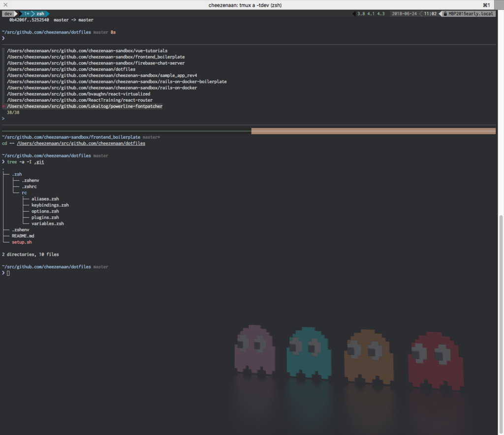

n 番煎じ感しかないけれど、半年に 1 回は訪れる「開発環境を根本から見直したい欲求」に従うままやってみた。

## はじめに

- `.zshrc` が育ってきたせいか `zsh` の起動が遅くなってきた
  - `zsh` の設定ファイル見直してダイエットしたい
- これまでは Mackup で Dropbox 上に設定ファイルをバックアップしていた
  - PC のクリーンインストール時にまず Dropbox を入れる所作がダルいことに気づいた
  - `git clone` からのシェルスクリプト一発叩いて終わる世界にしたかった

## Tl;dr

[cheezenaan/dotfiles: cheezenaan's dotfiles: for zsh](https://github.com/cheezenaan/dotfiles)

```sh
$ git clone git@github.com:cheezenaan/dotfiles.git ~/dotfiles
$ cd ~/dotfiles
$ sh /setup.sh
# That's all!
```

## やったこと

### ディレクトリ構造を見直した

```sh
$ tree ~/dotfiles -a -I .git
.
├── .zsh
│   ├── .zshenv ... 環境変数(PATH や EXPORT) を定義
│   ├── .zshrc ... rc/ 以下の設定ファイルを読み込ませたり autoload を定義してる
│   └── rc
│       ├── aliases.zsh ... もろもろのエイリアス集
│       ├── keybindings.zsh ... カスタムキーバインド集
│       ├── options.zsh ... setopt をまとめて定義
│       ├── plugins.zsh ... zplug で使用するプラグイン集
│       └── variables.zsh ... もろもろの変数集
├── .zshenv ... ただのエントリーポイント
├── README.md
└── setup.sh ... ホームディレクトリにシンボリックリンクを貼るシェルスクリプト
```

`/dotfiles` 直下の `.zshenv` は `$ZDOTDIR` を定義して `source $ZDOTDIR/.zshenv` をするだけで、設定の実態は `/.zsh/` 以下のファイルで行うようにした。

### zplug でプラグイン管理する

prezto は使い勝手こそよかったのだけど基本全部入りなため、シェルの起動に時間がかかりがちだった。必要なものだけをプラグインとして読み込ませるようにすれば多少はマシになるのでは…という思いからプラグインマネージャーの導入を検討。 prezto などの外部ライブラリのプラグインやテーマも管理できる点に惹かれて zplug を採用。 [README](https://github.com/zplug/zplug/blob/master/doc/guide/ja/README.md) が充実してるのも好印象。

[zplug/zplug: A next-generation plugin manager for zsh](https://github.com/zplug/zplug)

自分が入れているプラグインの一覧は以下の通りで、 prezto からは autocompletion 用の module を持ち込んだ。あれがないと生活できない身体になってしまったのでな…。

```sh
# .zsh/rc/plugins.zsh

# Clone zplug if not exist
if [[ ! -d ~/.zplug ]]; then
  git clone https://github.com/zplug/zplug ~/.zplug
fi

source ~/.zplug/init.zsh

# zsh plugins
zplug "zsh-users/zsh-autosuggestions"
zplug "zsh-users/zsh-completions"
zplug "zsh-users/zsh-syntax-highlighting", defer:2

zplug "junegunn/fzf-bin", as:command, from:gh-r, rename-to:fzf
zplug "mafredri/zsh-async", from:github
zplug "mollifier/anyframe", lazy:true
zplug "motemen/ghq", from:gh-r, as:command, rename-to:ghq, lazy:true
zplug "sindresorhus/pure", use:pure.zsh, from:github, as:theme

zplug 'modules/utility', from:prezto
zplug "modules/completion", from:prezto

# Install uninstalled plugins
zplug check --verbose || zplug install
zplug load
```

### peco から fzf に乗り換えた

これまで peco を使っていて不満もなかったけど、見た目がより好みだったのでこの機に乗り換えてみた。 fzf もまた [README](https://github.com/junegunn/fzf/blob/master/README.md) が非常に充実しているのがよい。 vim 用のプラグインもあるみたいだけど今回は導入見送り。

[junegunn/fzf: A command-line fuzzy finder](https://github.com/junegunn/fzf)

もともと anyframe を使用していたおかげで peco からの移行もスムーズ。

### シンボリックリンクを貼るシェルスクリプトを用意した

dotfiles.git のシンボリックリンクを `$HOME` 以下に貼り付けるかんたんなスクリプトをシュッ書いた。

```sh
#!/bin/sh

basepath=$(
	cd $(dirname $0)
	pwd
)

if [ ! -d ~/.zsh/rc ]; then
	mkdir -p ~/.zsh/rc
fi

ln -sf $basepath/.zshenv ~/.zshenv

for rcfile in .zsh/rc/*; do ln -sfv $basepath/$rcfile ~/.zsh/rc; done
for zfile in .zsh/.z*; do ln -sfv $basepath/$zfile ~/.zsh; done
```

## ベンチマークをとった

```sh
$ for i in $(seq 1 5) ; do time ($SHELL -l -ic exit) ; done
( $SHELL -l -ic exit; )  0.43s user 0.46s system 102% cpu 0.867 total
( $SHELL -l -ic exit; )  0.41s user 0.44s system 103% cpu 0.822 total
( $SHELL -l -ic exit; )  0.44s user 0.48s system 100% cpu 0.919 total
( $SHELL -l -ic exit; )  0.44s user 0.48s system 96% cpu 0.954 total
( $SHELL -l -ic exit; )  0.43s user 0.47s system 102% cpu 0.877 total
```

整理前は 2 ~ 3 秒かかっていたことを考えると、1 秒未満ならまぁ許容範囲…だと思いたい。

## まとめ

homebrwe で zsh さえインストールしさえすれば、 `git clone` とスクリプトを実行するだけで、シェル周りの環境が整うようになってとても気持ちがいい。今までなんとなくで書いていた `.zshrc` まわりの設定ファイルの意味や読み込み順が理解できたし、役割ごとにファイルを分割したことで少しはメンテナンスしやすくなったと思う。頃合いを見て vim やほかの CLI ツールの設定ファイルもも dotfiles リポジトリに移していきたい。

## 参考資料

### zsh 全般

- [zsh の設定ファイルの読み込み順序と使い方 Tips まとめ - Qiita](https://qiita.com/muran001/items/7b104d33f5ea3f75353f)
- [zsh が起動時に読み込むファイルとその内容について - vorfee's Tech Blog](http://vorfee.hatenablog.jp/entry/2015/03/05/211447)
- [dotfiles 整理 その 1：zsh の構成を見なおそう - bauer's diary](http://kitakitabauer.hatenablog.com/entry/2016/09/13/173456)
- [もっと便利になれる zsh プラグインによる CLI ライフ - Qiita](https://qiita.com/b4b4r07/items/f37aadef0b3f740e8c14)

### zplug

- [おい、Antigen もいいけど zplug 使えよ - Qiita](https://qiita.com/b4b4r07/items/cd326cd31e01955b788b#%E7%89%B9%E5%BE%B4)

### fzf / peco + anyframe

- [おい、peco もいいけど fzf 使えよ - Qiita](https://qiita.com/b4b4r07/items/9e1bbffb1be70b6ce033)
- [私の peco 活用事例 - k0kubun's blog](https://k0kubun.hatenablog.com/entry/2014/07/06/033336)
- [zsh で peco と連携するための anyframe というプラグインを作った - Qiita](https://qiita.com/mollifier/items/81b18c012d7841ab33c3)
