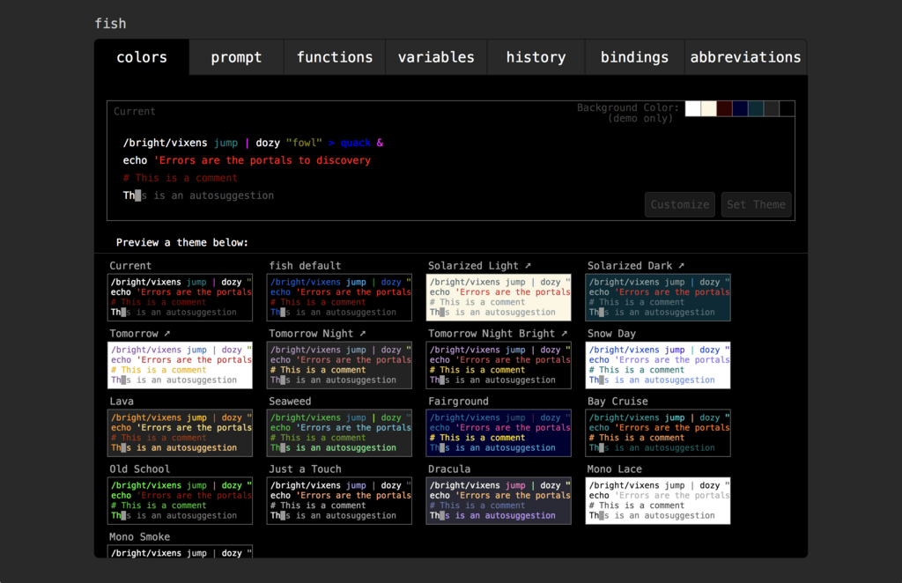

## Tl;dr

<blockquote class="twitter-tweet" data-lang="ja"><p lang="ja" dir="ltr">即落ち2コマ並のノリで zsh から fish に寝返ろうとしている😇</p>&mdash; cheezenaan (@cheezenaan) <a href="https://twitter.com/cheezenaan/status/1010828604316401664?ref_src=twsrc%5Etfw">2018年6月24日</a></blockquote>

<blockquote class="twitter-tweet" data-lang="ja"><p lang="ja" dir="ltr">はぁ〜〜〜〜 fish 最高すぎか〜〜〜〜〜〜〜〜〜✌</p>&mdash; cheezenaan (@cheezenaan) <a href="https://twitter.com/cheezenaan/status/1011168798395658240?ref_src=twsrc%5Etfw">2018年6月25日</a></blockquote>

<blockquote class="twitter-tweet" data-lang="ja"><p lang="ja" dir="ltr">2年くらいかけて zsh で作ってきた環境が1時間ちょいで fish 上でできた &amp;&amp; 設定ファイルめっちゃ減った &amp;&amp; シェルの起動時間が当社比で8割カットになった</p>&mdash; cheezenaan (@cheezenaan) <a href="https://twitter.com/cheezenaan/status/1011174781629034499?ref_src=twsrc%5Etfw">2018年6月25日</a></blockquote>

控えめに言って最高でした。

## やったこと

[Introduce fish by cheezenaan · Pull Request #5 · cheezenaan/dotfiles](https://github.com/cheezenaan/dotfiles/pull/5)

コミットを追っていってください :pray:

### Introduce fish

平成生まれの非 POSIX シェル。 **Fr**iendly **I**nteractive **SH**ell の略称らしい。

`bash` や `zsh` とは異なり、オートコンプリートなどの便利機能が設定不要でいきなり使えることが大きな特徴。

[fish shell](https://fishshell.com/)

```/bin/sh
brew install fish
```

`chsh -s` でログインシェルにはせずにターミナル側でよしなに `fish` を呼び出してやる。 iTerm2 の場合は `Preferences > General > Command` から `/usr/local/bin/fish` を指定してやれば OK。

### 設定ファイル

`$HOME/.config/fish/config.fish` に記述する。ターミナル上から `fish_config` と入力すると Web ブラウザ上から fish の設定を変更できる。



### fisherman でプラグイン管理

[jorgebucaran/fisher: A package manager for the fish shell](https://github.com/jorgebucaran/fisher)

```sh
curl -Lo ~/.config/fish/functions/fisher.fish --create-dirs git.io/fisherman
```

`zsh` でいうところの `zplug` 的なやつ。使い勝手的には `gem` とか `bundler` っぽい。

- `fisher ls-remote` でインストールできるプラグインの一覧を検索
- `fisher <plugin>` でプラグインをインストール

### fzf と ghq を fish でも使えるようにする

zplug 経由で ghq を導入できたが fisherman には対応するものがないので素直に homebrew からインスコする。

```sh
brew install ghq fzf
```

fish 上から fzf や ghq を操作するプラグインがあるのでよしなにインスコ。

```sh
fisher decors/fish-ghq fzf
```

### 自動補完

```sh
fish_update_completions
```

`man` コマンドから補完を自動生成してくれるらしい。なにこれやばい。

### 環境変数の定義

bash や zsh で `export PATH=/usr/local/bin:$PATH` としていたのを `set -x PATH /usr/local/bin $PATH` と変更していく。

環境変数の定義をしていくと、セッションを呼び出すたびに `PATH` がどんどん長くなる問題にぶち当たった。
`set -x` の使い方に問題があったので、 `fish.config` の末尾にこんなワンライナーを付け足して解消した。

```fish
# ./config/fish/config.fish

# Remove redundant paths
set -x PATH (echo $PATH | tr ' ' '\n' | sort -u)
```

スペース区切りで並んだ `$PATH` から `sort -u` で重複を削除している。

### エイリアスの設定とか

`zsh` で使用していたエイリアス集を別ファイルから読み込ませた。`alias foo='bar'` が `alias foo 'bar'` となっただけで瞬殺で移行できた。

### tmux とのつなぎこみ

reattach-to-user-namespace で使用するシェルを `fish` に変更する。

```sh
# ~/.tmux.conf

# ...

set-option -g default-command "reattach-to-user-namespace -l $(which fish)"
```

## ベンチマークしてみた

```fish
$ for i in (seq 1 5) ; time fish -ic exit ; end
        0.12 real         0.08 user         0.04 sys
        0.11 real         0.08 user         0.03 sys
        0.11 real         0.07 user         0.04 sys
        0.11 real         0.07 user         0.03 sys
        0.11 real         0.08 user         0.04 sys
```

な　ん　で　す　か　、　こ　れ　。

今までの努力はなんだったのか。

## 所感

手持ちの設定ファイルの量にもよるけど、シュッとデフォルト設定のまま試してみてよさそうなら移行を考えてもいいのでは。自分の場合はそこまでがっつりカスタマイズして `zsh` 固有のなにかを使ってたわけでもないし、とりあえず `ghq` と `fzf` が気持ちよく使えればよかったので、今回を機に `fish` へ移行してみて概ね満足している。

### pros

- zsh に比べて設定ファイルの記述量が圧倒的に少なくて済む
  - ゼロコンフィグの波をシェルにも感じる
- しかも速い！！！！！
  - スピード is 大正義
- [日本語のドキュメント](http://fish.rubikitch.com/)が充実してるので割と安心

### cons

- シェルスクリプトの文法や環境変数の定義にひとクセある
- fisherman を dotfiles で管理するベストプラクティスが知りたい

## 参考資料

### fish 全般

- [あなたが zsh/bash/eshell から fish に乗り換えるべき 17 の理由](http://emacs.rubikitch.com/zsh-fish-emacs-eshell/)
- [zsh から fish にした - HsbtDiary(2017-04-21)](https://www.hsbt.org/diary/20170421.html)
- [fish-shell でシェルの海をスイスイ泳いでみた | ヌーラボ](https://nulab-inc.com/ja/blog/backlog/fish-shell-tutorial/)

### rbenv まわり

- [Fish Shell を導入し rbenv/pyenv/nodebrew のパスを通す - SIS Lab](https://www.meganii.com/blog/2018/04/27/implementation-fish-shell/)

### プロンプトのカスタマイズ

- [fish のプロンプトの右側をカスタマイズして、git のブランチと status を表示させる - Qiita](https://qiita.com/mom0tomo/items/b593c0e98c1eea70a114)
- [(超入門)fish でプロンプトを変えたい人へのチュートリアル - Qiita](https://qiita.com/najayama/items/553329c242edc434b155#_reference-2c03c712e4e5f8f4c07e)

### 環境変数とか

- [fish shell の起動が遅くなった時の解決方法 - Qiita](https://qiita.com/WorldDownTown/items/dc6cc40226f5942fb30d)
