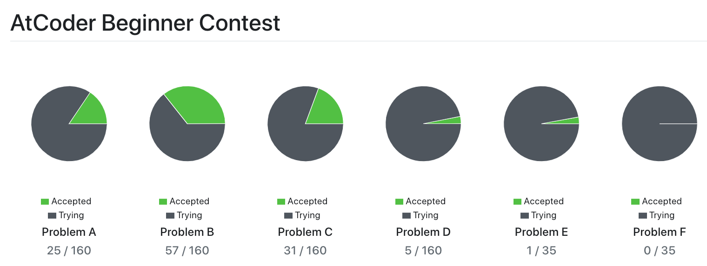
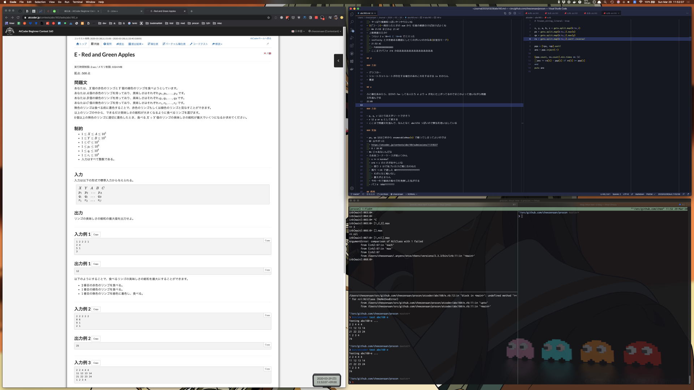

興味本位で AtCoder のコンテストに参加しはじめて気づけば 1 ヶ月経ったので、スナップショットがてら現況をまとめてみる。

## やってること

出社前の 1 時間くらいで ABC の過去問を 2 ~ 3 問解いている。ABC-B が中心だけど、たまに ABC-C にチャレンジしたり、ABC-A の速解きタイムアタックをやってみたり。あとはバスや電車の移動時間を使って、茶 ~ 緑 diff くらいの自分にとってやや難しめな問題を眺めて脳内で方針を練ってみたり。

実際に問題に取り組む際はエディタを左右に二分割して、左半分にメモ欄を用意しつつ右半分に提出するコードを書いている。メモ欄には問題文を読んでから方針をまとめてコードに落とし込むまで、あるいはコードを提出してから WA や TLE した際のハマりどころやリカバリーまでの思考をなぐり書きしているのだけど、自力 AC するか方針が立たず解説の PDF を読んだ後に「あー、ここのポイントに気づけたらもっとラクに実装できたなあ」と振り返りに役立っている気がする。

## 所感

### 実装の初速が上がった気がする

あくまで自分の感覚だけど、ある仕様が与えられた際に「なんとなくこんなロジックを組み立てればいけるやろ」の段階まで短時間でたどり着けることが以前よりも多くなった。

### Ruby の書きやすさ

競技プログラミングをはじめて以降、リファレンスマニュアルを参照する頻度が増えたのもあるけど、こうやりたいんだよな〜と思うものが Ruby の標準ライブラリにほぼ揃っていて、どれも直感的な書き味で使えるのがよい。 `Integer#upto` や `Integer#times` はループ回す際に常用してるし、集計や絞り込みは `Enumerable#inject` や `Enumerable#select` にブロック渡してシュッとやれるのが最高。先日の ABC160-E で使った `Enumerable#max(n)` も地味に便利。

## 今後

ABC 本番で A ~ C の 3 完を安定して達成しつつ、D 問題以上にチャレンジできるようになりたい。

- ABC 過去問を解き進める
  - ABC-B をすべて、 ABC-C を半分以上埋めたい
- 螺旋本を読み進める
  - 典型的なアルゴリズムやデータ構造を理解したい
